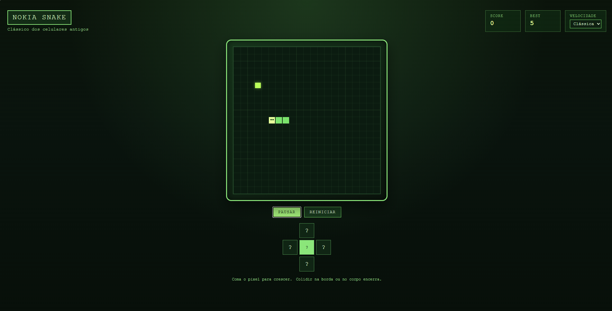

# Snake Game (Nokia Style)

Um jogo da cobrinha inspirado nos celulares Nokia clássicos, feito em Angular. Interface retrô, controles por teclado e D‑pad, placar e melhor pontuação persistida no navegador.

## Screenshot



## Como rodar localmente

1. Instale dependências:
   ```bash
   npm install
   ```
2. Inicie o servidor de desenvolvimento:
   ```bash
   npm start
   ```
3. Abra no navegador:
   ```
   http://localhost:4200
   ```

## Controles

- Teclado: setas ou WASD
- Espaço: iniciar/pausar
- Botões na tela: D‑pad e Iniciar/Pausar

## Build de produção

```bash
npm run build
```

A saída fica em `dist/chatbot-frontend`.

## Deploy (site estático)

### Netlify

1. Build command: `npm run build`
2. Publish directory: `dist/chatbot-frontend`
3. Se publicar em subpasta, use `npm run build -- --base-href /sua-subpasta/`.

### Vercel

1. Framework: Other
2. Build command: `npm run build`
3. Output directory: `dist/chatbot-frontend`
4. Se publicar em subpasta, use `npm run build -- --base-href /sua-subpasta/`.

### GitHub Pages

1. Build com base do repositório:
   ```bash
   npm run build -- --base-href /snakeGame/
   ```
2. Publique o conteúdo de `dist/chatbot-frontend` no branch `gh-pages`.
3. Em Settings > Pages, selecione o branch `gh-pages`.

### Firebase Hosting

1. Instale o CLI:
   ```bash
   npm install -g firebase-tools
   ```
2. Faça login:
   ```bash
   firebase login
   ```
3. Inicialize o hosting apontando para `dist/chatbot-frontend` e marque SPA:
   ```bash
   firebase init hosting
   ```
4. Gere o build:
   ```bash
   npm run build
   ```
5. Faça o deploy:
   ```bash
   firebase deploy
   ```

## Tecnologias

- Angular
- TypeScript
- HTML Canvas

## Licença

Uso livre para fins educacionais.
